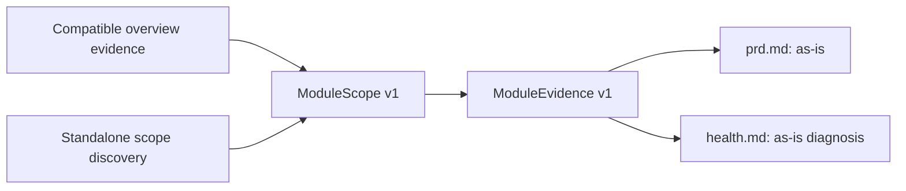

# Module Drill MVP Contract

## Purpose and non-goals

Module Drill produces two evidence-backed descriptions of one recovered module:

- `prd.md`: a PM-facing description of the module's observed current state.
- `health.md`: a developer-facing diagnosis of the module's boundaries and changeability.

It does not infer desired product behavior, prove production activation, run a hidden
project overview, or parse Markdown to recover facts. This document defines the
contract before implementation; it does not retain the retired Phase 1 drill-down
command or its run layout.

## One core, two scope sources

The core consumes `ModuleScope v1` and produces `ModuleEvidence v1`; it does not
know whether the scope came from overview or standalone discovery.

### Overview-backed source

`--from-run <run-id>` selects one explicit overview. Without it, a future command may
use an accepted current overview only when the selector has one unambiguous match.
The selected run and source snapshot must be shown to the user.

An overview is reusable only when all of the following match the requested target:

- workspace/project identity and recorded source snapshot;
- supported contract version;
- required capability coverage; and
- a unique, evidence-backed module match.

The reusable portion is static evidence: module candidates, call/dependency boundaries,
routes, data-access evidence, and relevant findings. The drill-down still performs
targeted source reads to verify each fact it presents. An explicit stale, incomplete,
unsupported, or insufficient overview is refused rather than silently replaced,
merged, or inferred from.

This is evidence reuse, not a caching system. MVP adds no content-addressed store,
replay mode, incremental invalidation, or cross-snapshot reuse. A changed source
snapshot requires a new overview or a new standalone analysis.

### Standalone source

A user may supply a workspace and a selector without first generating an overview. A
selector can be an evidence-backed module name/alias, repository-relative path,
package, symbol, route, or API entry. Standalone discovery is limited to provenance,
minimal workspace/repository discovery, and targeted scope resolution; it must not
invoke overview narrative generation or the complete overview lens suite.

One high-confidence scope may proceed automatically. Multiple plausible scopes are
returned for user selection. No evidence anchor, ambiguous scope, missing target, or
unsupported contract is a hard refusal. Dirty worktrees, non-Git folders, unsupported
providers, and unprovable activation are inspection-only or reduced-coverage states,
not reasons to fabricate a result.

## ModuleScope v1

`ModuleScope v1` is technology-neutral and contains only normalized source facts:

| field | required | meaning |
|---|---:|---|
| `contract_version` | yes | The supported `ModuleScope` contract version. |
| `source_mode` | yes | `overview` or `standalone`. |
| `project` | yes | Workspace/project identity and exact source snapshot/provenance. |
| `selector` | yes | Original user selector and selector kind. |
| `module` | yes | Resolved identity, name, aliases, classification, and confidence. |
| `owned_scope` | yes | Included repositories, roots, files/symbols, and their evidence anchors. |
| `assigned_candidates` | no | Candidate IDs supplied by a compatible overview. |
| `boundaries` | yes | Direct inbound/outbound references and boundary-only neighbors. |
| `coverage` | yes | Capability status, limits, unresolved alternatives, and unknowns. |
| `overview_lineage` | no | Source run identity/snapshot and reusable evidence references. |
| `finding_hints` | no | Overview findings that may seed investigation but are not facts. |

It has no framework-specific fields and exposes no prompts, packets, task graphs,
Markdown structure, or producer implementation details.

Owned scope is the resolved module implementation. Supplementary analysis may include
only directly evidenced first-order context needed to explain it: UI/actor/access
entries, interfaces, data stores, jobs/events, integrations, callers, and dependencies.
Neighbor implementation remains boundary context and is never recursively absorbed.

## ModuleEvidence v1

`ModuleEvidence v1` is the canonical bundle produced from `ModuleScope v1`, bounded
source reads, and scope-aware capability providers.

| field | required | meaning |
|---|---:|---|
| `contract_version` | yes | The supported `ModuleEvidence` contract version. |
| `scope_ref` | yes | The exact `ModuleScope` identity/snapshot consumed. |
| `facts` | yes | Normalized facts with source/sanitized-signal references, status (`observed`, `inferred`, `unresolved`), and activation when applicable. |
| `boundaries` | yes | Verified direct callers, dependencies, interfaces, data, jobs/events, and integrations. |
| `coverage` | yes | Provider status, unsupported capabilities, read limits, and unresolved relationships. |
| `source_reads` | yes | Bounded targeted reads used to verify presentation facts. |
| `finding_hints` | no | Related overview findings, explicitly marked as hints. |

Every factual claim has a source or sanitized-signal reference. Provider failures,
unsupported stacks, and scope limits remain explicit coverage gaps. Overview findings
never bypass source verification. Both human documents consume this bundle; neither
independently discovers a second set of facts.

## Output responsibilities

`prd.md` describes the recovered current state, where evidenced: responsibility, real
UI labels and entry points, actors/access, core flows, rules/states, data,
notifications/jobs/integrations, and explicit unknowns. It is not a desired-state PRD
or proof that repository paths run in production.

`health.md` describes current developer-facing conditions: owned scope, direct
boundaries, module-local findings, coupling/changeability, safety-net limitations, and
representative evidence-backed change-impact paths.

## Generic examples

**Overview-backed:** an accepted overview maps selector `billing` to one module and
provides an API route, direct callers, a storage edge, and partial UI coverage. The
drill-down reuses those anchors, reads the module roots and entry files, verifies the
claims it emits, and states that UI coverage is partial.

**Standalone:** a user selects `packages/invoices`. Targeted discovery identifies one
package root and its direct API interface but cannot prove a UI caller. The drill-down
uses that package as owned scope, records the interface as a boundary, and presents the
UI relationship as unknown rather than running a full overview or inventing a flow.

## Mapping from overview artifacts

When compatible, overview artifacts provide only inputs to the normalized scope:

- `targets.json`, identity/provenance, and run state provide source identity;
- `module-map.json` and module candidates provide module identity, aliases, and assigned
  candidates;
- system-model, callgraph, dependency, route, and data evidence provide direct
  boundaries and anchors;
- capability/coverage artifacts provide limits and unknowns; and
- findings provide optional investigation hints.

A future overview implementation remains compatible by emitting these normalized facts;
Module Drill never depends on its orchestration or report internals.
